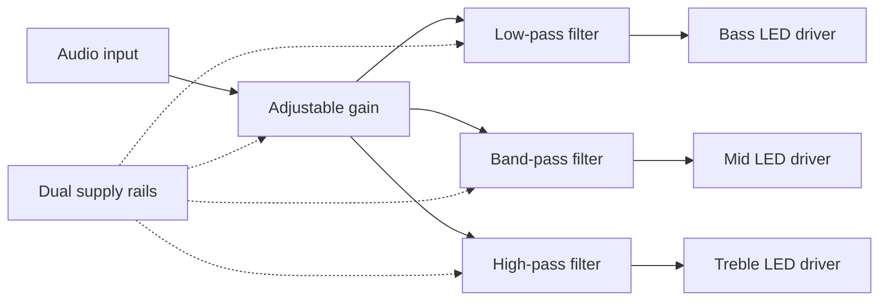
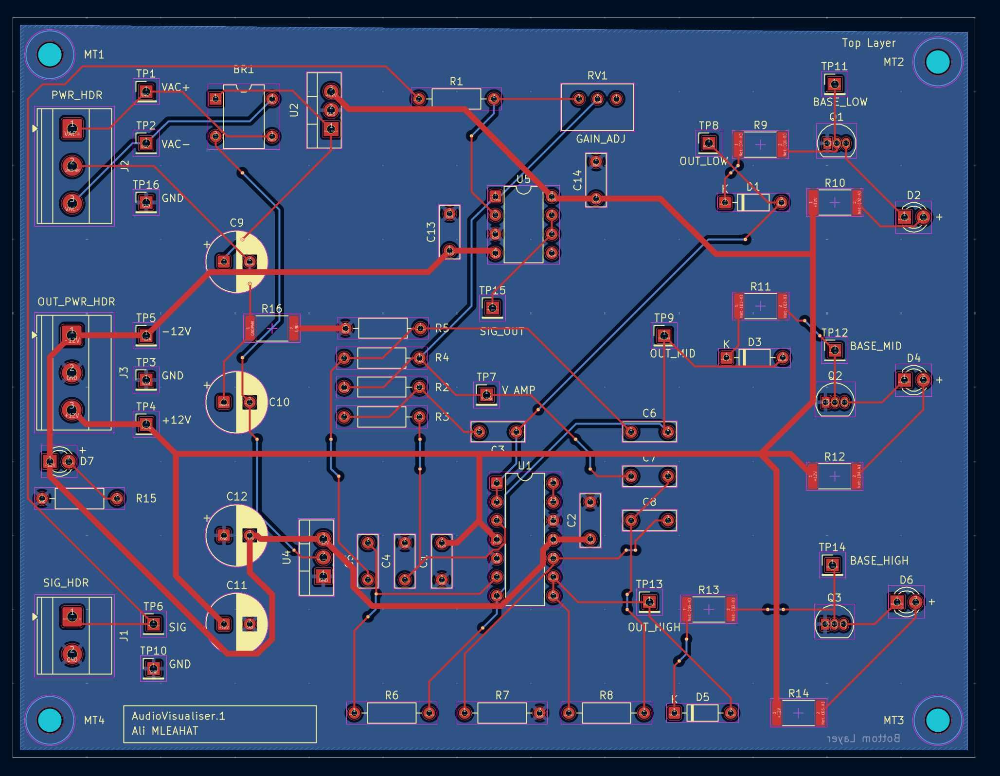
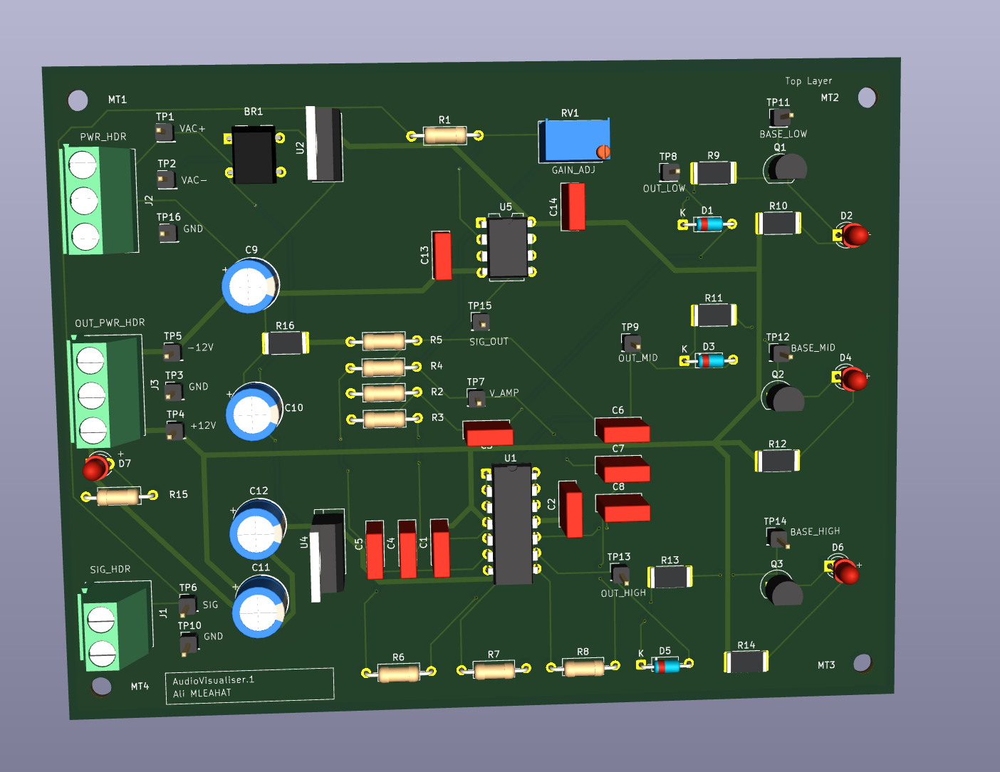
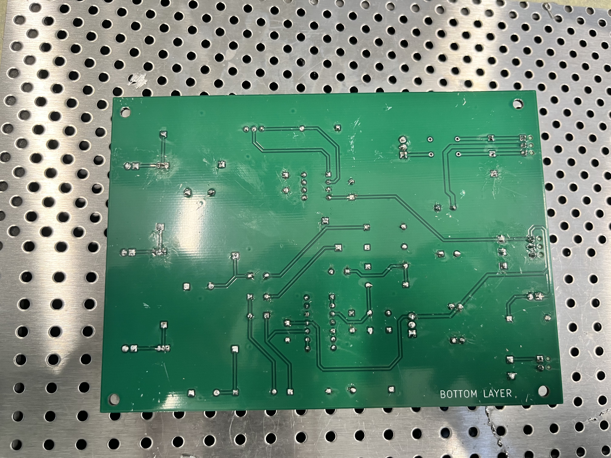
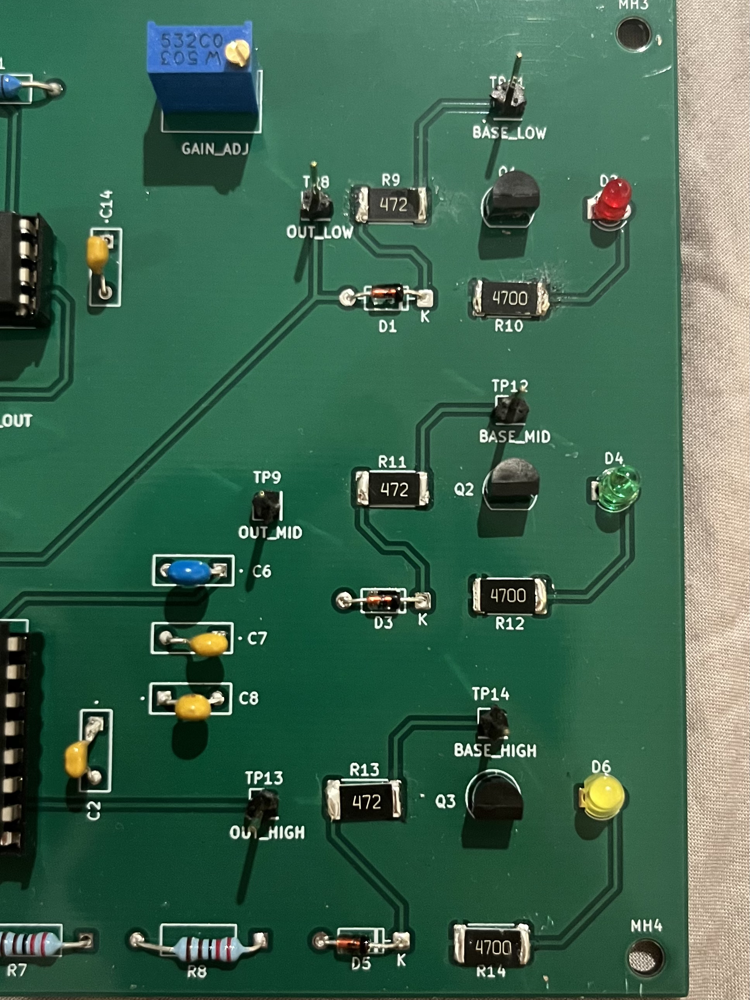

# Analog Audio Visualizer PCB

**A three-band audio visualizer taken from schematic capture through PCB layout, assembly, and bench testing.**

Audio is split into bass, midrange, and treble paths, each driving an LED through an analog filter and transistor stage. The board uses op-amps and discrete components, with adjustable input gain and dual ±12 V rails.

**KiCad 9 · Analog electronics · Two-layer PCB · Through-hole and SMD assembly · Bench testing**


[Demo videos](https://github.com/alimleahat/analog-audio-visualizer-pcb/releases/tag/v1.0) · [Schematic](docs/images/schematic.png) · [PCB layout](docs/images/pcb-layout.png) · [Testing notes](docs/testing.md)

## My work

I completed the schematic capture, component footprint assignment, PCB placement and routing, fabrication-file preparation, assembly, and testing for this **ELEC2101 Electronic Circuits and Systems Design** coursework project.

The project followed the course's *PCB Design Main Manual* and supplied reference circuit. My contribution is the implementation and physical build of that guided design. The course manual is credited here and is not redistributed in this repository.

## What the circuit does

1. **Input stage:** an LM2904 amplifier and 50 kΩ adjustment provide input gain control.
2. **Filter bank:** LM2902 op-amp stages separate low-, mid-, and high-frequency content.
3. **LED drive:** signal diodes and 2N3904 transistors drive the three indicator LEDs.
4. **Power:** the design includes a bridge rectifier, reservoir capacitors, and positive/negative regulators. The demonstrated assembly was powered directly from a regulated bench supply.



## Design and build

- Two copper layers, with signal/power routing and a ground pour.
- Four mounting holes and 16 labelled test points for inspection and measurement.
- Through-hole ICs, connectors, and passive components, plus SMD resistors.
- Editable KiCad project, original manufacturing outputs, and a bill of materials.
- Build photographs showing the assembled board, solder side, and SMD detail.

<details>
<summary>View the layout and assembly details</summary>

### PCB layout



### Original 3D preview



The CAD preview represents the design, including BR1. The physical build omitted BR1 and used a yellow treble LED.

### Solder side



### SMD assembly



</details>

## Testing and evidence

The original bench records document **+11.99 V at TP4** and **−12.03 V at TP5**, with photos of both readings. The submitted checklist records responses from all three signal LEDs and a working sensitivity adjustment.

**Test configuration:** BR1 was not populated because the component was unavailable. The board was supplied through J3 from a regulated ±12 V bench supply. The AC input, bridge rectifier, and regulator path were not validated by this test. D6 used a yellow LED instead of the specified blue LED.

Fresh checks of the preserved design in **KiCad 9.0.7** found:

- **ERC:** zero reported violations under the saved project rules.
- **PCB DRC:** zero reported layout violations and zero unconnected items.
- **Schematic parity:** four warnings for PCB-only mounting-hole footprints MT1–MT4.

These checks do not replace electrical characterization. Measured filter frequency-response curves and AC power-path testing are not included. See [testing details and reports](docs/testing.md).

## Open the project

1. Install KiCad 9 with its standard symbol and footprint libraries.
2. Open [`hardware/audiovisualiser.kicad_pro`](hardware/audiovisualiser.kicad_pro).
3. Use the project manager to open the schematic or PCB editor.
4. Inspect the design and saved rule settings before making changes or generating new production files.

The original design filenames are retained so the project, schematic, and PCB share the same basename.

## Repository contents

```text
hardware/                 Editable KiCad project, schematic, and PCB
manufacturing/gerbers/    Original copper, mask, silkscreen, outline, and drill files
manufacturing/           Bill of materials and component positions
docs/images/             Selected design, assembly, and measurement images
docs/validation/         Original screenshots and current KiCad reports
docs/testing.md          Bench configuration, measurements, and limitations
docs/source-selection.md File selection and provenance notes
```

The [v1.0 release](https://github.com/alimleahat/analog-audio-visualizer-pcb/releases/tag/v1.0) carries the original demo recordings separately from the source files.

## Project context

**Author:** Ali Mleahat · **Module:** ELEC2101

This is a guided coursework hardware project. The circuit topology and instructional material originate from the course reference. Existing embedded component-library information is retained; no open-source hardware license has been selected.
