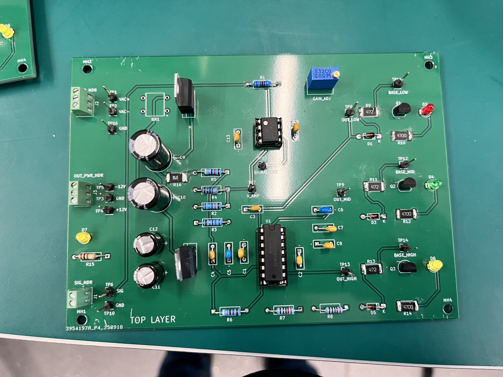

# Analog Audio Visualizer PCB

A three-band audio visualizer built for **ELEC2101 Electronic Circuits and Systems Design**. It separates audio into bass, midrange, and treble, with an LED responding to each band.

## My contribution

Following the course guide and reference circuit, I completed the schematic in KiCad, assigned component footprints, laid out and routed the PCB, prepared the manufacturing files, assembled the board, and tested it in the lab.

The project gave me practical experience with analog circuits, two-layer PCB layout, through-hole and surface-mount soldering, and electrical measurements.

## How it works

The audio input passes through an adjustable amplifier, then three filters separate the low, middle, and high frequencies. Transistor circuits drive the corresponding LEDs. The circuit uses LM2904 and LM2902 op-amps and a dual ±12 V supply.

[View the schematic](docs/images/schematic.png) · [View the PCB layout](docs/images/pcb-layout.png)

## Assembly and testing

The board was assembled and tested using a regulated bench supply connected through J3. The recorded supply measurements were **+11.99 V** and **−12.03 V**. The lab checklist records all three LEDs responding to audio and the sensitivity adjustment working.

The bridge rectifier BR1 was unavailable, so the AC-input power-supply section was not tested. The treble LED is yellow instead of the blue LED specified in the design.

[Solder-side photo](docs/images/solder-side.png) · [Surface-mount detail](docs/images/smd-detail.png) · [Measurement photos and test notes](docs/testing.md)

## Open the design

Open [`hardware/audiovisualiser.kicad_pro`](hardware/audiovisualiser.kicad_pro) in **KiCad 9** with the standard symbol and footprint libraries installed. The project includes the editable schematic and PCB layout.

The folders contain:

- **`hardware/`** — KiCad project, schematic, and PCB.
- **`manufacturing/`** — Gerber and drill files for fabrication, a bill of materials, and component positions.
- **`docs/`** — design images, assembly photos, measurements, and design-check reports.

The latest KiCad checks report no electrical or PCB layout violations under the saved rules, and no unconnected items. Four comparison warnings identify mounting holes that appear only on the PCB. Details are in the [testing notes](docs/testing.md).

## Credits

**Ali Mleahat — ELEC2101 coursework.** Circuit topology and instructions were supplied by the course; the schematic capture, PCB implementation, assembly, and testing are my work. The course manual is not included. No open-source hardware license has been selected.
