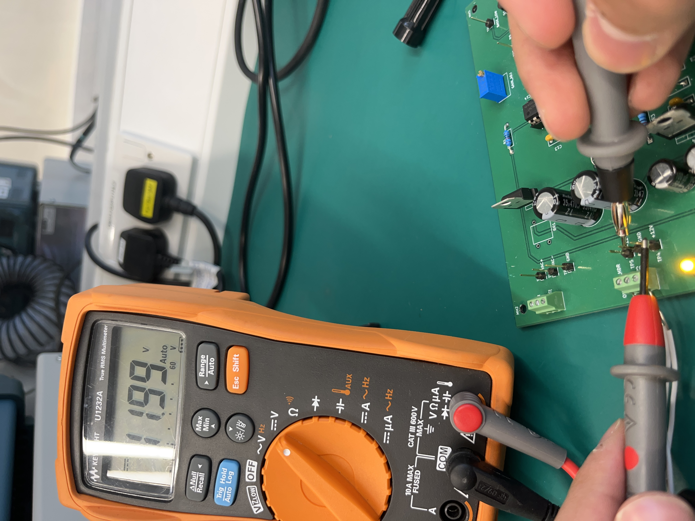
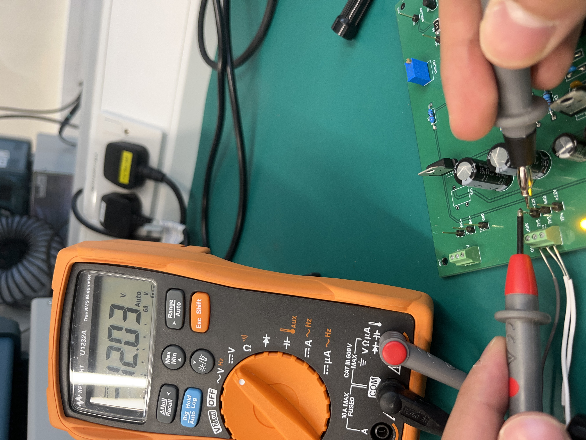
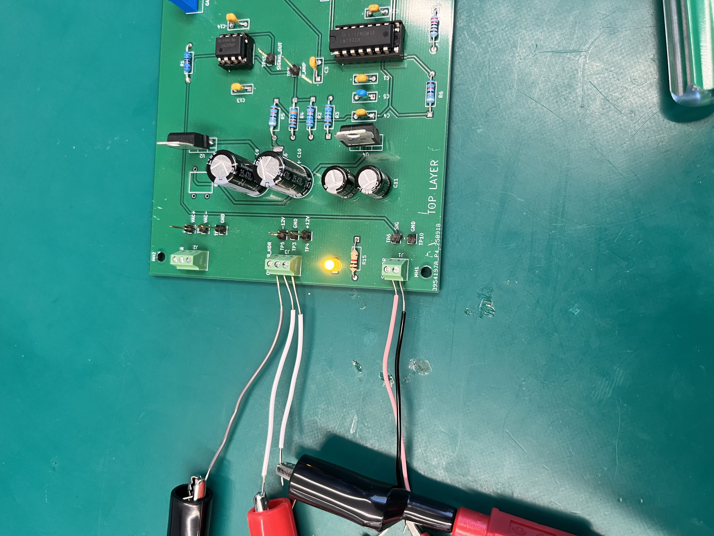

# Testing and validation

## Bench configuration

The assembly was powered from a regulated dual bench supply through J3, using the board's +12 V, GND, and −12 V connections. BR1 (DB107-BP) was unavailable and was not fitted. The AC-input path through J2, BR1, the reservoir capacitors, and the regulators was not tested. The recorded rail voltages therefore demonstrate the externally supplied rails, not regulator performance.

D6, the treble indicator, was fitted with a yellow LED instead of the blue LED listed in the design BOM. These deviations are recorded in the final Week 11 submission notes.

## Recorded measurements

- TP4, positive rail: **+11.99 V**.
- TP5, negative rail: **−12.03 V**.
- The original checklist also records small no-input DC offsets at the amplifier and filter outputs, and successful LED response and sensitivity-adjustment checks.

The photos are original bench evidence. The operating measurements have not been repeated during repository preparation. The broad “all tests passed” wording in the original checklist is not used here because the AC power path was explicitly untested.

## KiCad checks

The preserved project was checked using KiCad 9.0.7 on 15 September 2026:

- [Electrical-rule report](validation/current-erc.json): no reported violations.
- [PCB-rule and schematic-parity report](validation/current-drc.json): no reported layout violations, no unconnected items, and four extra-footprint warnings for mounting holes MT1–MT4.

The four mounting footprints are `MountingHole_3.2mm_M3` mechanical features placed directly on the PCB. They have no corresponding schematic symbols. No circuit connectivity mismatch was reported.

Checks use the project's saved rule severities; some rule categories are configured to be ignored. The archived [ERC screenshot](validation/original-erc.png) shows four ignored tests; the archived [DRC screenshot](validation/original-drc.png) shows five and did not run schematic parity. The current reports are provided alongside them for clarity.

## Validation limits

The evidence does not include a swept frequency-response measurement, quantified distortion/noise, measured cutoff tolerances, or verification of the AC-to-DC power path. The recordings and checklist document a functional demonstration rather than complete analog performance characterization.
